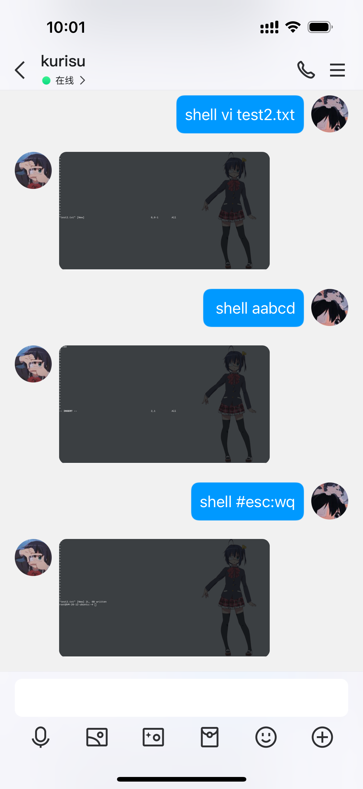
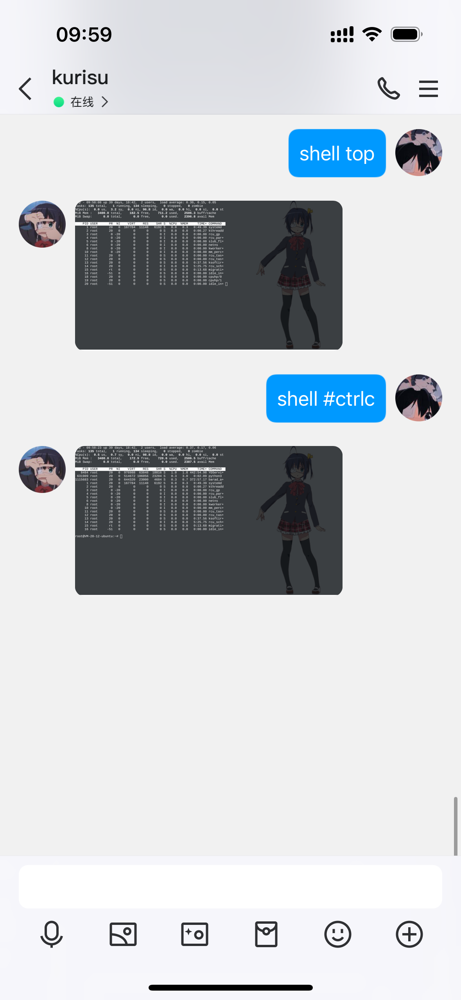
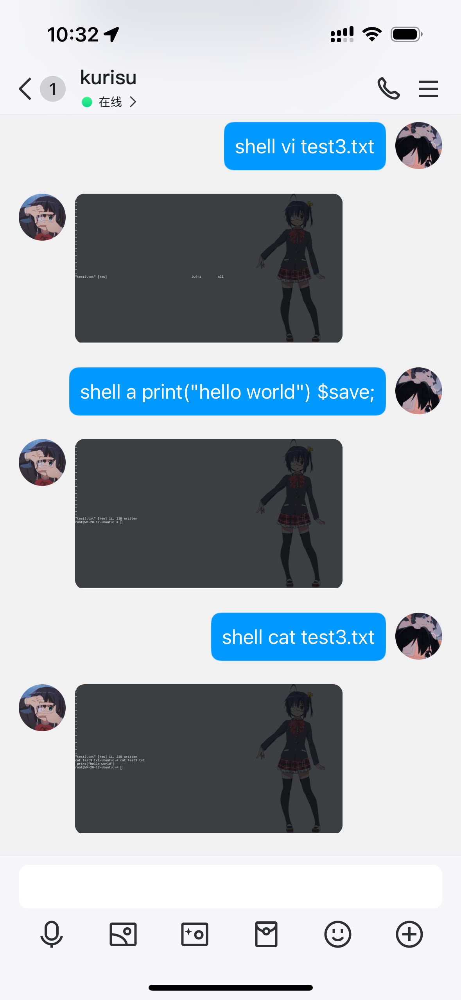
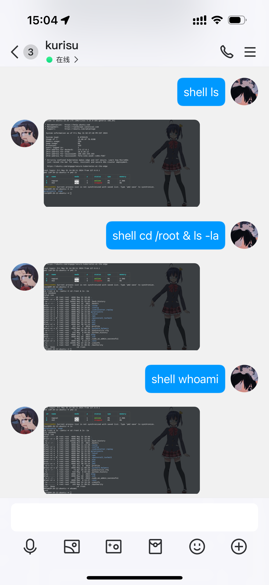

<h1 align="center">✨QQShell✨</h1>
<p align="center">
_✨ QQShell 是一个类 WebSSH、XShell 的运行在机器人的 SSH Shell，在 QQ 中自由运行你的命令吧✨_
</p>

## 说明

1. 为什么要开发这个插件？它会被用于哪些场景？
   之所以开发这个插件，是因为有些时候想到某个配置，希望能够快速看一下，但是手机上没有ssh工具，即便有也不是很方便，需要打开以及连接。
   需求非常明确，希望在使用 bot 的时候不切换 app 达到快速查看或者快速运行某个命令。

2. 为什么把这个插件称为类似于 SSH ？
   因为我希望这个 Shell 是一个完全仿真的 Shell，即可交互和有状态。大家不妨尝试使用一下类似于 subprocess 之类的命令转发。
   它会有两个最大的问题：一是无法切换工作目录，即类似于 cd 之类的命令，是无法实现的，因为是由 subprocess 代执行命令，它在哪，那么你的命令工作目录就在哪；
   第二个是类似于 top 和 htop，以及 vi 这类需要交互的程序是没办法实现的，因为这既需要 ESC 这类的控制符号，也要求程序维护着 vi 这类命令的持续状态。
   所以这个插件虽然仅仅只想拥有查看本机的命令，仍然使用了 SSH 来建立一个完整的可交互的 Shell 工具。
   这个插件使用了 paramiko 维持一个 SSH 和 Invoke Shell，在展示部分使用了 xterm.js，可以很好得展示转义符号、颜色符号、控制符号等等

3. <del>现在版本存在的问题：还没有把 superuser 加上；还没有把转义符号加上；预计在5号前完成，因为现在在外面旅游；</del>


## 快速安装

第一步：右上角 ↗ 点个不要钱的 star 吧，这是不断维护更新的动力。

### nb-cli

```shell
nb plugin install nonebot-plugin-qqshell
```
### pip

```shell
pip install nonebot-plugin-qqshell
```

### git

```shell
cd /your-nonebot-project-home/plugins/
git clone https://github.com/yejue/nonebot-plugin-qqshell.git
```

## 使用
`shell` 或者 `>shell` + "你要执行的命令"
```text
shell ls
shell cd /awesome-bot
shell reboot
```

## 控制符转发

在一个 shell 中，总会使用到 `esc`、`ctrl+c` 等，目前对这些内容做了转发，转发表如下。

| 源文本    | 转发文本 |   含义  |
|--------|--|-----|
| #esc   | \x1b |   ESC 按钮  |
| #ctrlc | \x03 |   CTRL+C 按钮，中断当前程序  |
| #ctrlz | \x1a |   CTRL+Z 按钮，挂起  |
| $save; | \x1b:wq |  魔术方法，即按了 ESC 后输入 :wq   |
| $stop; | \x03 |  魔术方法，等同于 CTRL+C   |

使用方法：在命令输入时输入表中的源文本即可

## 配置
```text
QQSHELL_HOST = "localhost"      # 主机名，默认为 localhost，必填
QQSHELL_PORT = 22               # SSH 端口号，默认为 22，非必填
QQSHELL_HOST_USER = "root"      # 用户，默认为 root，必填
QQSHELL_HOST_PASSWORD = ""      # 密码，必填
QQSHELL_PRIORITY = 10           # 匹配优先级，默认为 10，非必填
QQSHELL_THEME = "theme_black_white_rikka"  # 主题，默认为黑色背景白色字体的 RIKKA，非必填

# 另一个主题：白色背景黑色字体的 RIKKA
QQSHELL_THEME = "theme_white_black_rikka"

# 本插件使用需具备超级用户权限
SUPERUSERS = ["你的QQ号"]

```

## 更新历史

## 0.1.0
此版本为在商店发布后第一个正式版，主要更新内容：
 - ESC、CTRL+C 等转义符转发
 - $save; 等的魔术符号
 - 比较好用的 CMD 执行
 - 限制使用为超级用户权限

## 排期
 - [x] ANSI 组合键`ESC`、`CTRL+C` 等转发
 - [ ] 手动连接与断开 SSH 链接
 - [ ] 主题背景可配置

## 示例
### vi、esc、ctrlc 转发

</img>

</img>

### vi 魔术方法保存

</img>

### 一般情况

</img>
