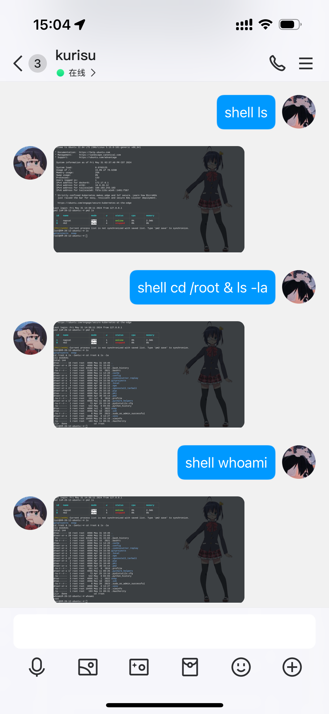

<h1 align="center">✨QQShell✨</h1>
<p align="center">
_✨ QQShell 是一个类 WebSSH、XShell 的运行在机器人的 SSH Shell，在 QQ 中自由运行你的命令吧✨_
</p>


## 快速安装

第一步：右上角 ↗ 点个不要钱的 star 吧，这是不断维护更新的动力。

### nb-cli

```shell
nb plugin install nonebot-plugin-qqshell
```
### pip

```shell
pip install nonebot-plugin-qqshell
```

### git

```shell
cd /your-nonebot-project-home/plugins/
git clone https://github.com/yejue/nonebot-plugin-qqshell.git
```

## 使用
`shell` 或者 `>shell` + "你要执行的命令"
```text
shell ls
shell cd /awesome-bot
shell reboot
```

## 配置
```text
QQSHELL_HOST = "localhost"      # 主机名，默认为 localhost，必填
QQSHELL_PORT = 22               # SSH 端口号，默认为 22，非必填
QQSHELL_HOST_USER = "root"      # 用户，默认为 root，必填
QQSHELL_HOST_PASSWORD = ""      # 密码，必填
QQSHELL_PRIORITY = 10           # 匹配优先级，默认为 10，非必填
QQSHELL_THEME = "theme_black_white_rikka"  # 主题，默认为黑色背景白色字体的 RIKKA，非必填

# 另一个主题：白色背景黑色字体的 RIKKA
QQSHELL_THEME = "theme_white_black_rikka"
```

## 排期
 - [ ] ANSI 组合键`ESC`、`CTRL+C` 等转发
 - [ ] 手动连接与断开 SSH 链接
 - [ ] 主题背景可配置

## 示例

</img>
